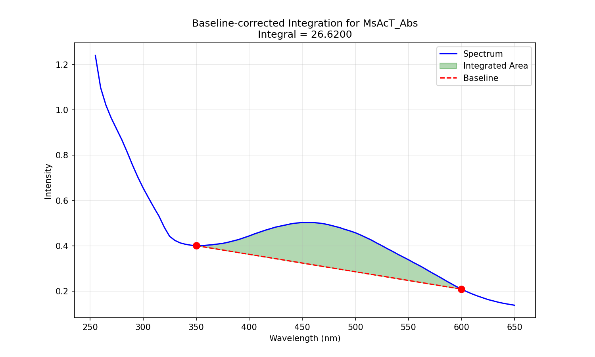

# spectral-integrator

CLI tool for calculating peak areas in spectral data (UV-Vis, absorbance) with baseline correction.



## What it does

Reads raw spectrometer output files (CSV), identifies spectral data columns automatically, and calculates the baseline-corrected integral between two wavelength bounds using the trapezoidal rule. The baseline is a straight line connecting the two endpoints.

Features:
- Parses raw spectrometer CSV files with metadata headers
- Handles detector overflow values (`OVRFLW`) gracefully
- Processes multiple data columns in a single run
- Generates annotated plots showing the spectrum, baseline, and integrated area
- Reports results in a clean tabular format

## Usage

```
python spec-int.py [input_file] [start_wavelength] [end_wavelength] [column_names]
```

**Arguments:**

| Argument | Default | Description |
|---|---|---|
| `input_file` | `example.csv` | Path to the spectrometer CSV file |
| `start_wavelength` | `400` | Lower wavelength bound (nm) |
| `end_wavelength` | `650` | Upper wavelength bound (nm) |
| `column_names` | `all` | Comma-separated column names, or `all` |

**Examples:**

```bash
# Integrate all columns from 400-650 nm using the example file
python spec-int.py

# Specify a file and wavelength range
python spec-int.py data.csv 370 650

# Process specific columns only
python spec-int.py data.csv 300 500 H1,H3,H5

# Explicitly process all columns
python spec-int.py data.csv 250 600 all
```

## Input format

The tool expects CSV files as output by plate-reader spectrometers. It looks for a row containing `Wavelength` as the header, treats everything above it as metadata, and parses numerical data below it. Non-numeric values like `OVRFLW` are handled automatically.

Example structure:

```
Software Version,3.10.06
Date,2025-01-26
Wavelength,Sample1,Sample2,Sample3
250,0.532,0.411,0.298
255,0.587,0.445,0.312
...
```

## Output

- **Console:** A table of baseline-corrected integral values per column
- **PNG plots:** One per column, showing the spectrum with the integration region and baseline highlighted

## Requirements

- Python 3.7+
- numpy
- matplotlib

Install dependencies:

```bash
pip install numpy matplotlib
```

## License

MIT
